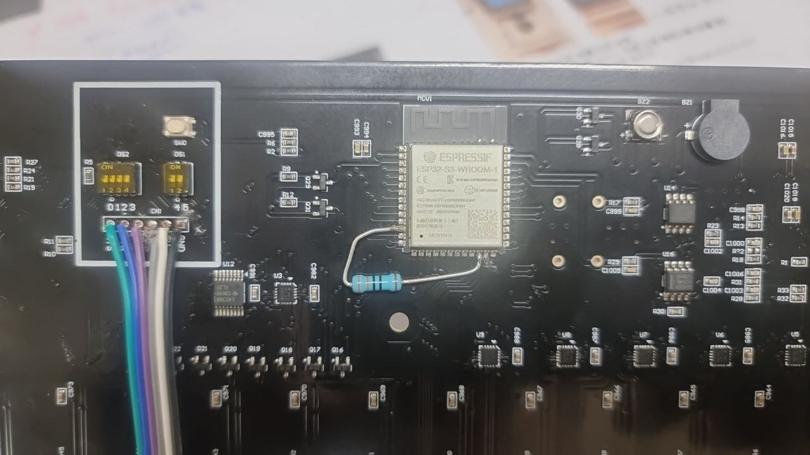

# Luxtep 매트 프로젝트 문서

#### <기초 설명> 이 폴더의 내용을 이해해줘. 이 파일(readme2.md) 를 읽으면 이 폴더 내부의 프로젝트를 이해할수 있어. IMPROVEMENTS.md는 향후 개선 방향이야. 그걸 RequirementsHistory.md 에 써진 순서대로 진행할거야.
무시할 폴더 : Resources, osddata, pio_tcp_mqtt_ota_v03
무시할 파일 : *.zip 파일

#### <시스템 설정> platformio.exe 의 위치 : C:\Users\USER\.platformio\penv\Scripts


## 1. 프로젝트 개요

본 프로젝트는 압력 센서 매트와 LED 매트릭스를 결합하여 사용자의 압력을 감지하고, 그에 따라 LED를 시각적으로 표현하는 시스템을 구축하는 것을 목표로 합니다. 시스템은 크게 **ESP32 기반의 TCP 클라이언트**와 **PC에서 실행되는 TCP 서버**로 구성됩니다.

- **ESP32 (TCP 클라이언트):** 압력 센서 데이터 측정, LED 제어, TCP 통신 및 OTA(Over-the-Air) 펌웨어 업데이트 기능을 담당합니다.
- **TCP 서버 (PC):** 다수의 ESP32 클라이언트와 연결하여 센서 데이터를 수신하고, OSD(On-Screen Display) 데이터를 전송하여 LED를 제어합니다.

 *<시연 영상: 발로 밟았을 때 LED 켜지는 모습>*

---

## 2. 폴더 구조 및 설명

```
prj24-luxtep-MAT_V3/
├── pio_Luxtep_03/              # ESP32 (TCP 클라이언트) 펌웨어
├── pio_tcp_mqtt_ota_v03/       # (참고용) TCP/MQTT/OTA 기능 개발 폴더
├── proc_tcp_mqtt_ota_v03/      # PC용 TCP 서버 애플리케이션
└── Resources/                  # 하드웨어 관련 자료
```

### 2.1. `pio_Luxtep_03` (ESP32 펌웨어)

- **역할:** TCP 클라이언트로서 압력 센서 데이터 측정 및 LED 제어
- **개발 환경:** Visual Studio Code + PlatformIO
- **주요 기능:**
    - 28x34 매트릭스 압력 센서 데이터 ADC 측정
    - 28x35 매트릭스 LED 제어 (NeoPixelBus 라이브러리 사용)
    - 측정된 센서 데이터를 TCP 서버로 전송
    - TCP 서버로부터 OSD(On-Screen Display) 데이터 수신 및 LED에 표시
    - OTA (Over-the-Air) 펌웨어 업데이트 (Direct, Firebase)
    - MQTT를 이용한 TCP 서버 IP 주소 자동 발견

### 2.2. `proc_tcp_mqtt_ota_v03` (TCP 서버)

- **역할:** 다수의 ESP32 클라이언트와 통신하며 데이터 중계 및 제어
- **개발 환경:** Processing IDE
- **주요 기능:**
    - 최대 8개의 ESP32 클라이언트와 TCP 소켓 통신
    - 클라이언트로부터 수신한 압력 센서 데이터 시각화
    - OSD 데이터를 생성하여 특정 또는 전체 클라이언트에 전송
    - MQTT를 통해 자신의 IP 주소를 브로드캐스팅하여 클라이언트가 서버를 찾을 수 있도록 지원
    - UI를 통해 MQTT 연결 제어, OSD 데이터 전송 등 다양한 기능 수행

### 2.3. `Resources`

- **내용:** 회로도, 부품 배치도, BOM, 데이터시트 등 하드웨어 관련 문서 및 이미지 포함


*<하드웨어 수정 사항 예시>*

---

## 3. 시스템 아키텍처

### 3.1. 하드웨어 구성

- **ESP32-S3:** 메인 컨트롤러
- **압력 센서 매트릭스 (28x34):** FSR(Force Sensitive Resistor) 센서로 구성되어 압력 감지
- **LED 매트릭스 (28x35):** WS2812C-2020-V1 LED로 구성되어 시각적 피드백 제공
- **통신:**
    - **보드 간 통신 (Intra-board):** RS485
    - **외부 통신 (Inter-board):** Wi-Fi (TCP/IP, MQTT)
- **전원:** USB PD (100W)

### 3.2. 소프트웨어 흐름

1. **초기화:**
   - ESP32는 Wi-Fi에 연결하고 MQTT 브로커에 접속합니다.
   - PC의 TCP 서버는 MQTT 브로커에 자신의 IP 주소를 `Publish`합니다.
   - ESP32는 MQTT `Subscribe`를 통해 TCP 서버의 IP 주소를 받아옵니다.

2. **데이터 통신:**
   - ESP32는 주기적으로 압력 센서 값을 스캔하여 TCP 서버로 전송합니다.
   - PC의 TCP 서버는 수신한 데이터를 분석하고, 필요한 경우 OSD 데이터를 생성하여 ESP32로 전송합니다.
   - ESP32는 수신한 OSD 데이터를 LED 매트릭스에 오버레이하여 표시합니다.

3. **펌웨어 업데이트 (OTA):**
   - 사용자가 특정 버튼 조합을 누르면 ESP32가 OTA 모드로 진입합니다.
   - OTA Direct 또는 Firebase를 통해 새로운 펌웨어를 다운로드하고 업데이트합니다.

---

## 4. 주요 기능 상세 설명

### 4.1. 압력 센서와 LED 연동

- 압력 센서(x, y)를 누르면 해당 위치의 바로 위, 아래에 있는 LED(x, y), (x, y+1)의 색상이 변경됩니다.
- `Blur` 모드가 활성화되면 주변 LED들도 함께 색상이 변경되어 부드러운 효과를 연출합니다.

### 4.2. TCP 통신 프로토콜

- **패킷 구조:** `Header (8 bytes)` + `Payload` + `Tail (2 bytes)`
- **Header:** `0xFF, 0xFF`로 시작하며, 패킷 종류, 길이 등의 정보를 포함합니다.
- **Tail:** `0xFE`로 끝납니다.
- **ESP32 -> 서버:** 952개의 센서 데이터 전송 (총 962 바이트)
- **서버 -> ESP32:** OSD 데이터 전송 (가변 길이)

### 4.3. MQTT를 이용한 동적 IP 연결

- 다수의 장비 세트가 동일 네트워크에 존재할 경우, 각 세트를 `AppID`로 구분합니다.
- PC 서버는 자신의 `AppID`와 IP 주소를 MQTT 토픽으로 발행합니다.
- ESP32는 자신의 `AppID`에 해당하는 MQTT 메시지만을 수신하여 올바른 TCP 서버에 접속합니다.

---

## 5. 빌드 및 실행 방법

### 5.1. ESP32 펌웨어 (`pio_Luxtep_03`)

1. **PlatformIO** 프로젝트를 엽니다.
2. `platformio.ini` 파일의 설정을 확인합니다.
3. **Build** 및 **Upload**를 실행합니다.

### 5.2. TCP 서버 (`proc_tcp_mqtt_ota_v03`)

1. **Processing IDE**에서 `proc_tcp_mqtt_ota_v03.pde` 파일을 엽니다.
2. 필요한 라이브러리(MQTT, ControlP5 등)가 설치되어 있는지 확인합니다.
3. **실행(Run)** 버튼을 클릭하여 서버를 시작합니다.
